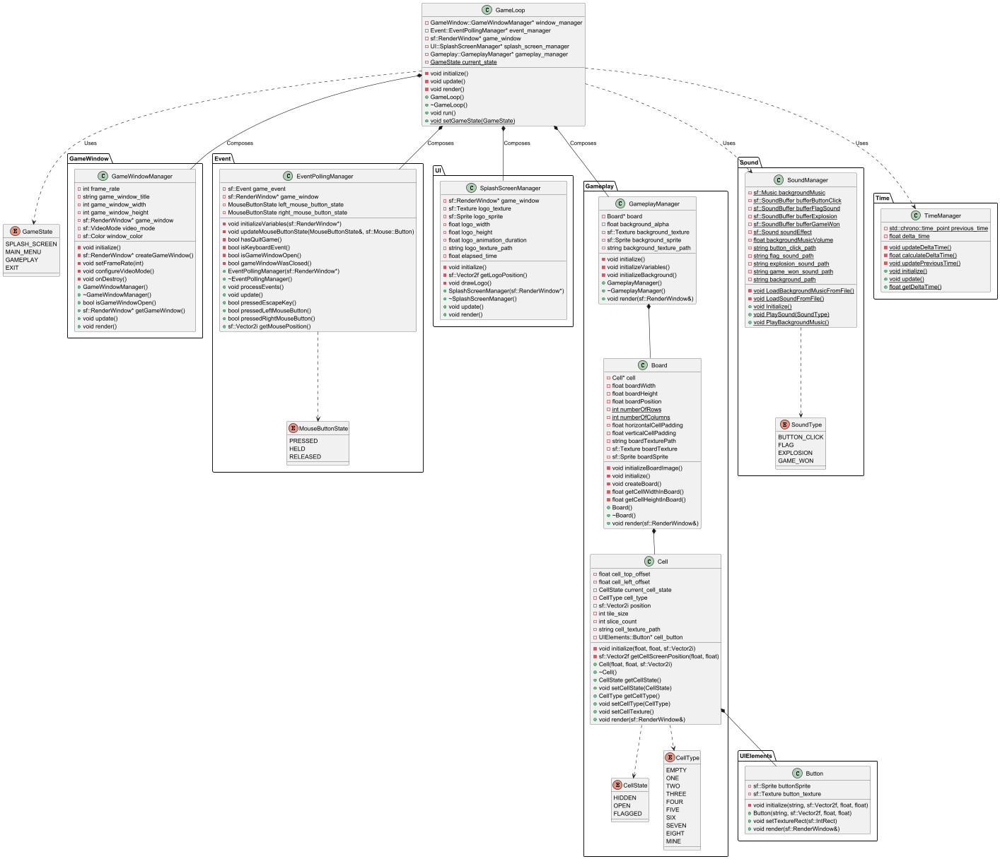

# Minesweeper

A classic implementation of the Minesweeper game built in C++ using the SFML library.

## Project Architecture

The project follows a component-based architecture, separating concerns into various managers that are controlled by a central `GameLoop`. This design promotes modularity, testability, and ease of maintenance.

### UML Class Diagram

The following diagram illustrates the high-level architecture of the game engine, including all major managers, their relationships, and key components.

